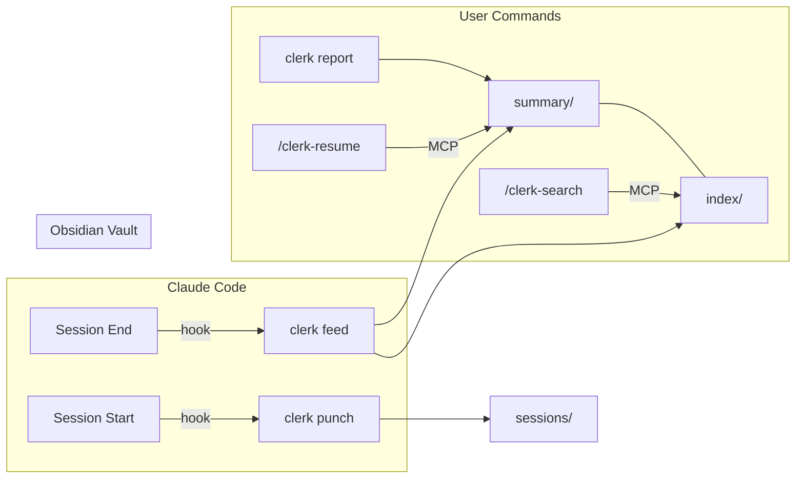

```
 ______     __         ______     ______     __  __    
/\  ___\   /\ \       /\  ___\   /\  == \   /\ \/ /    
\ \ \____  \ \ \____  \ \  __\   \ \  __<   \ \  _"-.  
 \ \_____\  \ \_____\  \ \_____\  \ \_\ \_\  \ \_\ \_\ 
  \/_____/   \/_____/   \/_____/   \/_/ /_/   \/_/\/_/  
```

[](https://github.com/vulcanshen/clerk/releases)
[](https://go.dev/)
[](https://goreportcard.com/report/github.com/vulcanshen/clerk)
[](LICENSE)

[English](README.md) | [繁體中文](README.zh-TW.md) | [한국어](README.ko.md)

Claude Code のセッションはターミナルを閉じると消えてしまいます。clerk があれば、自分が何をしたか見失うことはありません。

## 課題

Claude Code を毎日使っているなら、こんな壁にぶつかったことがあるはずです：

- **コンテキストの喪失** — `-c` や `--resume` を付け忘れて、ゼロからやり直し。前のセッションには完全なコンテキストがあったのに、大量のセッション ID の中から見つけ出すのは至難の業。
- **セッションの混乱** — 複数のプロジェクト、複数のセッション、すべてが並行稼働。今朝 API サーバーで何をした？認証の修正はどのセッションだった？全く思い出せない。
- **週報パニック** — 金曜の午後、週報の時間。`git log` を掘り返して、今週実際に何をしたか必死に思い出そうとする。
- **手動の記録管理** — Claude に「要約を保存して」と頼んだけど、前回は忘れた。あるいはセッションがクラッシュした。あるいはターミナルを閉じた。コンテキストは消えた。

これらはすべて一つのことに帰結します：**Claude Code はセッション間の記憶を持たない。そしてあなたが覚えておく必要もないはずです。**

## 解決策

```bash
clerk install
```

以上です。clerk は完全にローカルで動作します — リモートサービスへの接続なし、アカウント不要、データがマシンの外に出ることはありません。必要なのは Claude Code だけです。

clerk は Claude Code に連携し、バックグラウンドで静かに動作します：

| 課題 | clerk の解決方法 |
|------|----------------|
| コンテキストの喪失 | `/clerk-resume` — 以前のセッションからコンテキストを即座に復元 |
| セッションの混乱 | プロジェクトごとの日次要約を自動生成、日付別に整理 |
| 週報 | `clerk report --days 7` — AI が生成するレポート、日付別・プロジェクト別に整理、そのまま貼り付け可能 |
| 手動の記録管理 | 完全自動 — 覚えるコマンドなし、身につける習慣なし |

clerk は**一度設定したら忘れていい**ツールです。一度インストールするだけで、すべてのセッションが自動的に要約、追跡、タグ付け、検索可能になります。コンテキストが必要になったら、スラッシュコマンド一つで呼び出せます。週報が必要な時も、いつでもすぐに：

```bash
clerk report --days 7
```

> **注意：** clerk は AI メモリツールではありません。AI メモリツールは AI が思い出すためのコンテキストを保存します。clerk は**あなた**が読むための要約を保存します — 日付別に整理され、キーワードで検索でき、週次レビューにすぐ使えます。

## 機能

- **自動要約** — Claude Code セッション終了時に増分要約を自動生成
- **レポート生成** — `clerk report --days 7` でサマリー・日付別・プロジェクト別の3視点で週次レポートを生成
- **コンテキスト復元** — `/clerk-resume` で前回のセッションからコンテキストを再構築
- **セマンティック検索** — `/clerk-search` で AI セマンティック推論による過去の作業検索
- **Obsidian 互換** — 出力ディレクトリを Obsidian vault として使用可能、タグのグラフビュー対応
- **セッション追跡** — 履歴検索のためにすべてのセッション開始を記録
- **タグシステム** — 要約からキーワードを自動抽出し、検索可能なインデックスを構築
- **カーソル追跡** — 前回以降の新しいメッセージのみを処理し、トークンと時間を節約
- **プロセス管理** — アクティブな feed の監視、強制終了、中断されたものの再試行
- **プロジェクトレベル設定** — プロジェクトごとに feed を無効化、グローバル設定を上書き
- **ワンコマンド設定** — `clerk install` でフック、MCP サーバー、スキルを一括設定
- クロスプラットフォーム：macOS、Linux、Windows
- シェル補完（bash、zsh、fish、powershell）

## 仕組み



### ライフサイクル

| イベント | 動作 |
|---------|------|
| **セッション開始** | `clerk punch` がセッション ID + トランスクリプトパスを記録 |
| **セッション終了** | `clerk feed` が要約を生成し、インデックス項目を構築 |
| **コンテキストが必要** | `/clerk-resume` が過去の要約とトランスクリプトを読み取る |
| **検索** | `/clerk-search` がインデックス項目のセマンティックマッチング |
| **レポートが必要** | `clerk report --days 7` が構造化レポートを生成 |

### データ構造

```
~/.clerk/
├── summary/YYYYMMDD/slug.md    ← プロジェクトごとの日次要約
├── index/term.md               ← 転置インデックス（タグ、日付、プロジェクト、キーワード）
├── sessions/slug.md            ← セッション ID 履歴
├── cursor/                     ← 増分処理状態
├── running/                    ← アクティブ feed プロセス状態
└── log/                        ← 日次ログ
```

## Obsidian 統合

`~/.clerk/` を Obsidian vault として開きます。グラフビューで多次元の接続が表示されます — タグ、日付、プロジェクト、キーワードがすべてノードとして要約にリンクされます。

### 要約フォーマット

各要約ファイルには関連するすべての項目を含む YAML フロントマターがあります：

```yaml
---
tags:
  - go
  - auth
  - jwt
  - 20260418
  - my-api-server
  - my
  - api
  - server
---
```

Obsidian はこれらのタグをタグペインとグラフビューフィルターに使用します。

### インデックスフォーマット

各インデックスファイルには、一致する要約への markdown リンクが含まれます：

```markdown
- [my-api-server+20260418](../summary/20260418/my-api-server.md)
- [my-api-server+20260419](../summary/20260419/my-api-server.md)
```

項目は自然に重複します — 「api」がスラッグの単語と AI 抽出タグの両方である場合、1つのグラフノードに統合され、プロジェクトとトピック間の接続を表示します。

## レポート

金曜の午後、週報の時間？コマンド一つで：

```bash
clerk report --days 7
```

clerk が過去7日間のすべての要約を読み取り、Claude に送って整理し、3つの視点で構造化レポートを出力します：

- **サマリー** — 期間全体の概要、プロジェクト別に整理
- **日付別** — 各日に何をしたか、プロジェクト別に分類
- **プロジェクト別** — 各プロジェクトの進捗、日付別に分類

stdout に出力。保存、貼り付け、お好みで：

```bash
clerk report --days 7 > weekly-report.md
```

デフォルトは `--days 1`（当日のみ）— デイリースタンドアップの要約に最適。

まだ終了していないセッションも含めたい場合は `--active` を追加：

```bash
clerk report --days 7 --active
```

> **注意：** `--active` はアクティブなセッションのトランスクリプトをその場で処理するため、追加の Claude API コールが発生します。このフラグなしでは、完了したセッションのみが含まれます。

出力例：

```markdown
### サマリー (2026-04-14 ~ 2026-04-18)

#### my-api-server
JWT によるユーザー認証の実装、レート制限ミドルウェアの追加、
高負荷時のコネクションプールリークの修正。

#### frontend-app
Vue 2 から Vue 3 への移行、Vuex を Pinia に置き換え、全ユニットテストを更新。

---

### 日付別

#### 2026-04-14
- **my-api-server**: リフレッシュトークンローテーション付き JWT 認証を構築
- **frontend-app**: Vue 3 移行開始、ビルド設定を更新

#### 2026-04-16
- **my-api-server**: レート制限ミドルウェア追加、コネクションプールリーク修正
- **frontend-app**: Vuex を Pinia に置き換え、12 ストアモジュールを移行

---

### プロジェクト別

#### my-api-server
- **2026-04-14**: リフレッシュトークンローテーション付き JWT 認証
- **2026-04-16**: レート制限ミドルウェア、コネクションプールリーク修正

#### frontend-app
- **2026-04-14**: Vue 3 移行開始、ビルド設定更新
- **2026-04-16**: Vuex → Pinia 移行、12 ストアモジュール変換
```

## インストール

### クイックインストール

macOS / Linux / Git Bash：

```bash
curl -fsSL https://raw.githubusercontent.com/vulcanshen/clerk/main/install.sh | sh
```

Windows（PowerShell）：

```powershell
irm https://raw.githubusercontent.com/vulcanshen/clerk/main/install.ps1 | iex
```

次にフック、MCP サーバー、スキルを設定します：

```bash
clerk install
```

### パッケージマネージャー

| プラットフォーム | コマンド |
|------------------|----------|
| Homebrew（macOS / Linux） | `brew install vulcanshen/tap/clerk` |
| Scoop（Windows） | `scoop bucket add vulcanshen https://github.com/vulcanshen/scoop-bucket && scoop install clerk` |
| Debian / Ubuntu | `sudo dpkg -i clerk_<version>_linux_amd64.deb` |
| RHEL / Fedora | `sudo rpm -i clerk_<version>_linux_amd64.rpm` |

### ソースからビルド

```bash
go install github.com/vulcanshen/clerk@latest
```

## コマンド一覧

| コマンド | 説明 |
|----------|------|
| `install` | すべてのコンポーネントをインストール（hook + mcp + skills）、`--force` で再インストール |
| `install hook` | SessionStart/SessionEnd フックのみをインストール |
| `install mcp` | MCP サーバーのみを登録 |
| `install skills` | スラッシュコマンドスキルのみをインストール |
| `uninstall` | すべてのコンポーネントを削除 |
| `config` | 現在の設定を表示（`config show` のエイリアス） |
| `config show` | マージされた設定とファイルパスを表示 |
| `config set <key> <value>` | プロジェクトレベルの設定値を変更 |
| `config set -g <key> <value>` | グローバル設定値を変更 |
| `status` | アクティブな feed プロセスと中断されたセッションを表示 |
| `status --watch` | ステータスをリアルタイム更新（毎秒） |
| `status retry <slug>` | 指定した中断セッションを再試行 |
| `status retry --all` | すべての中断セッションを再試行 |
| `status kill <slug>` | 指定したアクティブ feed プロセスを強制終了 |
| `status kill --all` | すべてのアクティブ feed プロセスを強制終了 |
| `report` | 最近の要約からレポートを生成（デフォルト：当日） |
| `report --days 7` | プロジェクト横断の週次レポート |
| `diagnosis` | 環境をチェックし問題を自動修復 |
| `diagnosis error` | トラブルシューティング用のエラーログを表示（`--mask` で個人情報をマスク） |
| `diagnosis log` | トラブルシューティング用の全ログを表示（`--mask` で個人情報をマスク） |
| `data moveto <path>` | clerk データを新しいディレクトリに移動し設定を更新 |
| `data purge` | すべての clerk データを削除（`-y` で確認スキップ） |
| `version` | バージョン表示とアップデート確認 |

内部コマンド（フックから呼び出されるもので、ユーザーが直接使用するものではありません）：

| コマンド | 説明 |
|----------|------|
| `feed` | セッションのトランスクリプトを処理し要約を生成 |
| `punch` | セッション開始時にセッション ID を記録 |
| `mcp` | MCP stdio サーバーを起動 |

## 設定

### 設定ファイル

- グローバル：`~/.config/clerk/.clerk.json`
- プロジェクト：`<cwd>/.clerk.json`（グローバル設定を上書き）

### 利用可能な設定

```json
{
  "output": {
    "dir": "~/.clerk/",
    "language": "en"
  },
  "summary": {
    "model": "",
    "timeout": "5m"
  },
  "log": {
    "retention_days": 30
  },
  "feed": {
    "enabled": true
  }
}
```

| 設定項目 | デフォルト値 | 説明 |
|----------|-------------|------|
| `output.dir` | `~/.clerk/` | 要約の保存ルートディレクトリ |
| `output.language` | `en` | 要約の出力言語 |
| `summary.model` | `""`（claude デフォルト） | `claude -p` で使用するモデル |
| `summary.timeout` | `5m` | `claude -p` のタイムアウト（例: 5m、2m30s、1h） |
| `log.retention_days` | `30` | ログとカーソルファイルの保持日数 |
| `feed.enabled` | `true` | このプロジェクトの feed を有効/無効にする |

### 使用例

```bash
# 特定のプロジェクトで feed を無効化
cd /path/to/unimportant-project
clerk config set feed.enabled false

# グローバルでより安価なモデルを使用
clerk config set -g summary.model haiku

# グローバルで出力言語を変更
clerk config set -g output.language en
```

## MCP ツール

MCP サーバーのインストール後に利用可能（`clerk install mcp`）。これらは Claude Code がスキルを通じて呼び出すもので、直接使用する必要はありません：

| ツール | 説明 |
|--------|------|
| `clerk-resume` | コンテキスト復元のための要約 + トランスクリプトファイルパスを返す |
| `clerk-index-list` | 利用可能なすべてのインデックス項目を一覧表示（タグ、日付、プロジェクト、キーワード） |
| `clerk-index-read` | 1つ以上のインデックス項目の内容を読み取る |

## スキル

スキルのインストール後に利用可能（`clerk install skills`）：

| スキル | 説明 |
|--------|------|
| `/clerk-resume` | 前回のセッションからコンテキストを復元 — MCP ツールを呼び出し、ファイルを読み込み、コンテキストを再構築 |
| `/clerk-search` | キーワードで過去のセッションを検索 — MCP ツールを呼び出し、一致するファイルを読み込み |

## トラブルシューティング

問題が発生した場合、まず diagnosis を実行してください — 環境をチェックし、一般的な問題を自動修復します：

```bash
clerk diagnosis
```

問題が解決しない場合、エラーログをエクスポートして [issue を作成](https://github.com/vulcanshen/clerk/issues)してください：

```bash
clerk diagnosis error --mask --days 7
```

`--mask` フラグは個人情報（ユーザー名、パス）をマスクするため、GitHub issue に安全に貼り付けできます。

## シェル補完

```bash
# Zsh
mkdir -p ~/.zsh/completions
clerk completion zsh > ~/.zsh/completions/_clerk
echo 'fpath=(~/.zsh/completions $fpath)' >> ~/.zshrc
echo 'autoload -Uz compinit && compinit' >> ~/.zshrc
source ~/.zshrc

# Bash
clerk completion bash > /etc/bash_completion.d/clerk

# Fish
clerk completion fish > ~/.config/fish/completions/clerk.fish

# PowerShell
New-Item -ItemType Directory -Path (Split-Path $PROFILE) -Force
clerk completion powershell | Set-Content $PROFILE
```

## ライセンス

[GPL-3.0](LICENSE)
