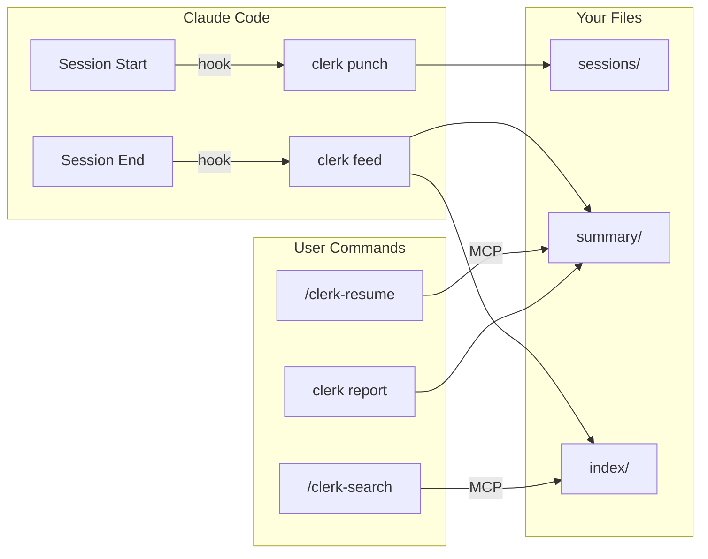
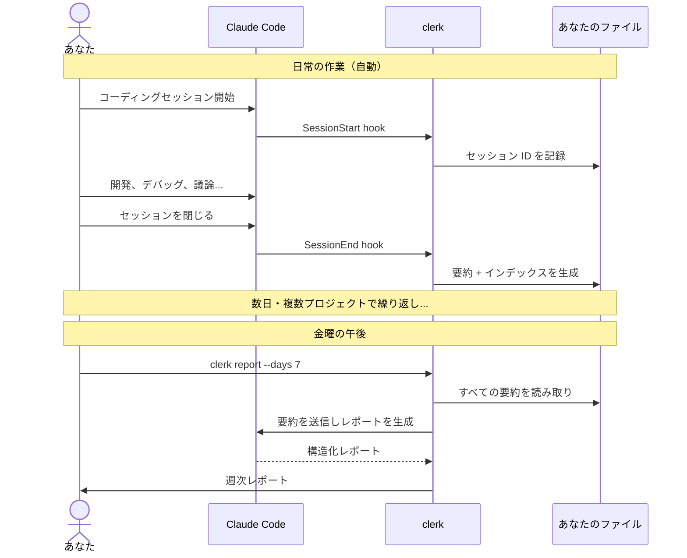

```
 ______     __         ______     ______     __  __    
/\  ___\   /\ \       /\  ___\   /\  == \   /\ \/ /    
\ \ \____  \ \ \____  \ \  __\   \ \  __<   \ \  _"-.  
 \ \_____\  \ \_____\  \ \_____\  \ \_\ \_\  \ \_\ \_\ 
  \/_____/   \/_____/   \/_____/   \/_/ /_/   \/_/\/_/  
```

[](https://github.com/vulcanshen/clerk/releases)
[](https://go.dev/)
[](https://goreportcard.com/report/github.com/vulcanshen/clerk)
[](LICENSE)

[English](README.md) | [繁體中文](README.zh-TW.md) | [한국어](README.ko.md)

**ほとんどの AI ツールは AI のために作られています。clerk は人間のために作られています。**

Claude Code のセッションはターミナルを閉じると消えてしまいます。clerk はそれを、あなたが所有する検索可能なナレッジベースに変えます。

## 課題

金曜の午後、週報の時間です。`git log` を開いて、3つのプロジェクト、8つのセッション、5日間で実際に何をしたか思い出そうとします。作業の半分は git に残っていません — デバッグ、調査、アーキテクチャの判断、Claude とのトレードオフの議論、もう忘れてしまったものばかりです。

Claude Code はセッション間の記憶を持ちません。そしてあなたが覚えておく必要もないはずです。

## Claude に直接聞けばいいのでは？

試してみてください。Claude Code を開いて「先週何をした？」と聞いてみてください。

知りません。現在のセッションしか見えないからです。過去を振り返るには、正しいセッション ID を見つけ、`--resume` で読み込み、要約を頼み、すべてのプロジェクトのすべてのセッションでそれを繰り返す必要があります。毎回 Claude は生のトランスクリプト全体を読み直します — 1つの markdown ファイルに保存できたはずのものを再構築するために、大量のトークンを消費します。

clerk のアプローチは異なります：セッション終了時に1回の API コールで増分要約を生成し、プレーンな markdown として保存します。金曜日には、あなたの1週間はすでに要約済みです。`clerk report --days 7` でそれらの要約を読み取り、一発で構造化レポートを生成します。

## 解決策

```bash
clerk register
```

以上です。clerk は完全にローカルで動作します — リモートサービスへの接続なし、アカウント不要、データがマシンの外に出ることはありません。

> **トークン消費について：** clerk は認証済みの Claude Code（`claude -p`）を使って要約とレポートを生成します。セッション終了時に要約の API コールが1回、`clerk report` 実行ごとにもう1回発生します。要約はカーソルトラッキングにより新しい会話内容のみを処理し、履歴全体を再読み込みすることはありません。クォータが気になる場合は、`summary.model` を `haiku` に設定するか、プロジェクト単位で feed を無効化できます（`clerk config set feed.enabled false`）。

登録後、clerk はバックグラウンドで静かに動作します：

| 得られるもの | 方法 |
|------------|------|
| **週次レポート** | `clerk report --days 7` — 日付別・プロジェクト別の構造化レポート、そのまま貼り付け可能 |
| **コンテキスト復元** | `/clerk-resume` — 以前のセッションからコンテキストを即座に再構築 |
| **検索可能な履歴** | `/clerk-search` — 全プロジェクト横断でキーワード検索 |
| **日次要約** | 自動 — 各セッション終了時に生成、日付・プロジェクト別に整理 |

一度登録するだけ。すべてのセッションが自動的に要約、インデックス化、検索可能になります。覚えるコマンドなし、身につける習慣なし。

## あなたのデータ、あなたのツール

clerk は標準的な YAML フロントマター + markdown で出力します — 独自フォーマットなし、ロックインなし。要約とインデックスファイルは以下のツールで読めます：

- 任意のテキストエディタ（vim、VS Code、Sublime）
- Obsidian（グラフビュー、タグペインがそのまま使える）
- Notion（markdown インポート）
- grep、ripgrep、その他任意の CLI ツール
- あなた自身のスクリプト

clerk と Claude Code を両方アンインストールしても、あなたの要約はそのまま残ります — 整理され、検索可能で、リンクされた状態で。

## 仕組み



### ユーザージャーニー



### ライフサイクル

| イベント | 動作 |
|---------|------|
| **セッション開始** | `clerk punch` がセッション ID + トランスクリプトパスを記録 |
| **セッション終了** | `clerk feed` が要約を生成し、インデックス項目を構築 |
| **コンテキストが必要** | `/clerk-resume` が過去の要約とトランスクリプトを読み取る |
| **検索** | `/clerk-search` がインデックス項目のセマンティックマッチング |
| **レポートが必要** | `clerk report --days 7` が構造化レポートを生成 |

### データ構造

**slug** は作業ディレクトリから生成されるファイルシステム安全な識別子です — 例えば `/Users/you/projects/my-app` は `projects-my-app` になります。ホームプレフィックスを除去し、小文字化し、`/` を `-` に置換します。

```
~/.clerk/
├── summary/YYYYMMDD/slug.md    ← プロジェクトごとの日次要約
├── index/term.md               ← 転置インデックス（タグ、日付、プロジェクト、キーワード）
├── sessions/slug.md            ← セッション ID 履歴
├── cursor/                     ← 増分処理状態
├── running/                    ← アクティブ feed プロセス状態
└── log/                        ← 日次ログ
```

### ファイルフォーマット

各要約には関連するすべての項目を含む YAML フロントマターがあります：

```yaml
---
tags:
  - go
  - auth
  - jwt
  - 20260418
  - my-api-server
---
```

各インデックスファイルには、一致する要約への markdown リンクが含まれます：

```markdown
- [my-api-server+20260418](../summary/20260418/my-api-server.md)
- [my-api-server+20260419](../summary/20260419/my-api-server.md)
```

項目は自然に重複します — 「api」がプロジェクト名の分割語と AI 抽出タグの両方である場合、同じファイルを指し、プロジェクトとトピック間の接続を作ります。

## レポート

金曜の午後、コマンド一つで：

```bash
clerk report --days 7
```

clerk が過去7日間のすべての要約を読み取り、Claude に送って整理し、3つの視点で構造化レポートを出力します：

- **サマリー** — 期間全体の概要、プロジェクト別に整理
- **日付別** — 各日に何をしたか、プロジェクト別に分類
- **プロジェクト別** — 各プロジェクトの進捗、日付別に分類

stdout に出力。保存、貼り付け、お好みで：

```bash
clerk report --days 7 -o weekly-report.md
```

デフォルトは `--days 1`（当日のみ）— デイリースタンドアップの要約に最適。

まだ終了していないセッションも含めたい場合は `--active` を追加：

```bash
clerk report --days 7 --active
```

> **注意：** `--active` はアクティブなセッションのトランスクリプトをその場で処理するため、追加の Claude API コールが発生します。このフラグなしでは、完了したセッションのみが含まれます。

出力例：

```markdown
### サマリー (2026-04-14 ~ 2026-04-18)

#### my-api-server
JWT によるユーザー認証の実装、レート制限ミドルウェアの追加、
高負荷時のコネクションプールリークの修正。

#### frontend-app
Vue 2 から Vue 3 への移行、Vuex を Pinia に置き換え、全ユニットテストを更新。

---

### 日付別

#### 2026-04-14
- **my-api-server**: リフレッシュトークンローテーション付き JWT 認証を構築
- **frontend-app**: Vue 3 移行開始、ビルド設定を更新

#### 2026-04-16
- **my-api-server**: レート制限ミドルウェア追加、コネクションプールリーク修正
- **frontend-app**: Vuex を Pinia に置き換え、12 ストアモジュールを移行

---

### プロジェクト別

#### my-api-server
- **2026-04-14**: リフレッシュトークンローテーション付き JWT 認証
- **2026-04-16**: レート制限ミドルウェア、コネクションプールリーク修正

#### frontend-app
- **2026-04-14**: Vue 3 移行開始、ビルド設定更新
- **2026-04-16**: Vuex → Pinia 移行、12 ストアモジュール変換
```

## インストール

### クイックインストール

**ステップ 1:** clerk バイナリをダウンロード

macOS / Linux / Git Bash：

```bash
curl -fsSL https://raw.githubusercontent.com/vulcanshen/clerk/main/install.sh | sh
```

Windows（PowerShell）：

```powershell
irm https://raw.githubusercontent.com/vulcanshen/clerk/main/install.ps1 | iex
```

**ステップ 2:** Claude Code に登録

```bash
clerk register
```

### パッケージマネージャー

| プラットフォーム | コマンド |
|------------------|----------|
| Homebrew（macOS / Linux） | `brew install vulcanshen/tap/clerk` |
| Scoop（Windows） | `scoop bucket add vulcanshen https://github.com/vulcanshen/scoop-bucket && scoop install clerk` |
| Debian / Ubuntu | `sudo dpkg -i clerk_<version>_linux_amd64.deb` |
| RHEL / Fedora | `sudo rpm -i clerk_<version>_linux_amd64.rpm` |

### ソースからビルド

```bash
go install github.com/vulcanshen/clerk@latest
```

## コマンド一覧

| API | コマンド | 説明 |
|:---:|----------|------|
| * | `register` | clerk を Claude Code に登録し環境を検証 |
| | `unregister` | clerk を Claude Code から登録解除 |
| | `config` | 現在の設定を表示（`config show` のエイリアス） |
| | `config show` | マージされた設定とファイルパスを表示 |
| | `config show --json` | 設定をJSON形式で出力 |
| | `config set <key> <value>` | プロジェクトレベルの設定値を変更 |
| | `config set -g <key> <value>` | グローバル設定値を変更 |
| | `status` | アクティブな feed プロセスと中断されたセッションを表示 |
| | `status --watch` | ステータスをリアルタイム更新（毎秒） |
| | `status --json` | ステータスをJSON形式で出力 |
| * | `status retry <slug>` | 指定した中断セッションを再試行 |
| * | `status retry --all` | すべての中断セッションを再試行 |
| | `status kill <slug>` | 指定したアクティブ feed プロセスを強制終了 |
| | `status kill --all` | すべてのアクティブ feed プロセスを強制終了 |
| | `export` | エクスポート可能なslugと日付を一覧表示 |
| | `export --summary <slug>` | 指定プロジェクトの要約を統合エクスポート（全日付） |
| | `export --date <YYYYMMDD>` | 指定日付の要約を統合エクスポート（全プロジェクト） |
| * | `report` | レポートを生成し `reports/` に自動保存（パイプ時: stdout） |
| * | `report --days 7 -o weekly.md` | プロジェクト横断の週次レポート |
| * | `logs` | トラブルシューティング用の全ログを表示 |
| * | `logs --error` | エラーログのみ表示 |
| | `logs --no-mask` | 個人情報をマスクせず生ログを表示 |
| | `data moveto <path>` | clerk データを新しいディレクトリに移動し設定を更新 |
| | `version` | バージョン表示とアップデート確認 |

`*` = Claude APIを使用（トークンを消費）

内部コマンド（フックから呼び出されるもので、ユーザーが直接使用するものではありません）：

| API | コマンド | 説明 |
|:---:|----------|------|
| * | `feed` | セッションのトランスクリプトを処理し要約を生成 |
| | `punch` | セッション開始時にセッション ID を記録 |
| | `mcp` | MCP stdio サーバーを起動 |

### v5.0.0 で廃止されたコマンド

| 旧コマンド | 新コマンド |
|-----------|-----------|
| `install` | `register` |
| `uninstall` | `unregister` |
| `diagnosis` | `register` |
| `diagnosis error` | `logs --error` |
| `diagnosis log` | `logs` |
| `data purge` | 廃止 — `rm -rf ~/.clerk/` を使用 |

## 設定

### 設定ファイル

- グローバル：`~/.config/clerk/.clerk.json`
- プロジェクト：カレントまたは任意の親ディレクトリの `.clerk.json`（最も近いものが優先）

### 利用可能な設定

```json
{
  "output": {
    "dir": "~/.clerk/",
    "language": "en"
  },
  "summary": {
    "model": "",
    "timeout": "5m"
  },
  "log": {
    "retention_days": 30
  },
  "feed": {
    "enabled": true
  }
}
```

| 設定項目 | デフォルト値 | 説明 |
|----------|-------------|------|
| `output.dir` | `~/.clerk/` | 要約の保存ルートディレクトリ |
| `output.language` | `en` | 要約の出力言語 |
| `summary.model` | `""`（claude デフォルト） | `claude -p` で使用するモデル |
| `summary.timeout` | `5m` | `claude -p` のタイムアウト（例: 5m、2m30s、1h） |
| `summary.instruction` | `""` | 要約プロンプトに追加するカスタム指示（`--append-system-prompt` 経由） |
| `report.instruction` | `""` | レポートプロンプトに追加するカスタム指示（`--append-system-prompt` 経由） |
| `log.retention_days` | `30` | ログとカーソルファイルの保持日数 |
| `feed.enabled` | `true` | このプロジェクトの feed を有効/無効にする |

### 使用例

```bash
# 特定のプロジェクトで feed を無効化
cd /path/to/unimportant-project
clerk config set feed.enabled false

# グローバルでより安価なモデルを使用
clerk config set -g summary.model haiku

# グローバルで出力言語を変更
clerk config set -g output.language en
```

## MCP ツール

登録後に利用可能（`clerk register`）。これらは Claude Code がスキルを通じて呼び出すもので、直接使用する必要はありません：

| ツール | 説明 |
|--------|------|
| `clerk-resume` | コンテキスト復元のための要約 + トランスクリプトファイルパスを返す |
| `clerk-index-list` | 利用可能なすべてのインデックス項目を一覧表示（タグ、日付、プロジェクト、キーワード） |
| `clerk-index-read` | 1つ以上のインデックス項目の内容を読み取る |

## スキル

登録後に利用可能（`clerk register`）：

| スキル | 説明 |
|--------|------|
| `/clerk-resume` | 前回のセッションからコンテキストを復元 — MCP ツールを呼び出し、ファイルを読み込み、コンテキストを再構築 |
| `/clerk-search` | キーワードで過去のセッションを検索 — MCP ツールを呼び出し、一致するファイルを読み込み |

## トラブルシューティング

問題が発生した場合、`register` を再実行してください — 環境をチェックし、一般的な問題を自動修復します：

```bash
clerk register
```

問題が解決しない場合、エラーログをエクスポートして [issue を作成](https://github.com/vulcanshen/clerk/issues)してください：

```bash
clerk logs --error --days 7
```

ログはデフォルトで個人情報（パス、ユーザー名等）が自動マスクされます。GitHub issue にそのまま貼り付けできます。生ログが必要な場合は `--no-mask` を追加してください。

## シェル補完

```bash
# Zsh
mkdir -p ~/.zsh/completions
clerk completion zsh > ~/.zsh/completions/_clerk
echo 'fpath=(~/.zsh/completions $fpath)' >> ~/.zshrc
echo 'autoload -Uz compinit && compinit' >> ~/.zshrc
source ~/.zshrc

# Bash
clerk completion bash > /etc/bash_completion.d/clerk

# Fish
clerk completion fish > ~/.config/fish/completions/clerk.fish

# PowerShell
New-Item -ItemType Directory -Path (Split-Path $PROFILE) -Force
clerk completion powershell | Set-Content $PROFILE
```

## ライセンス

[GPL-3.0](LICENSE)
