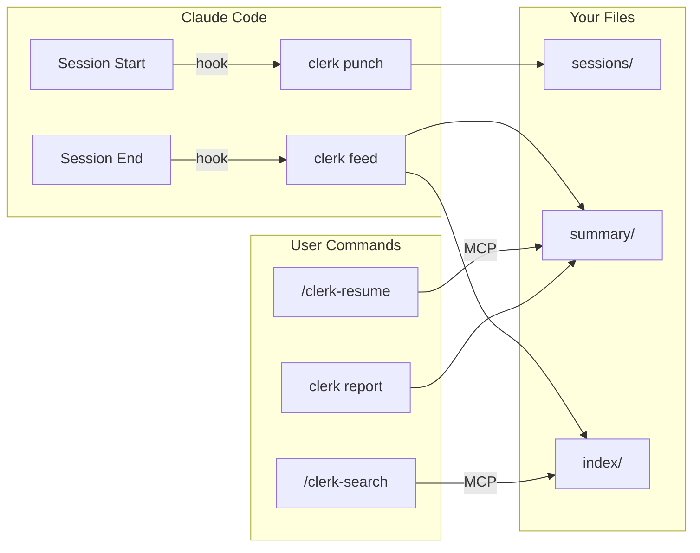
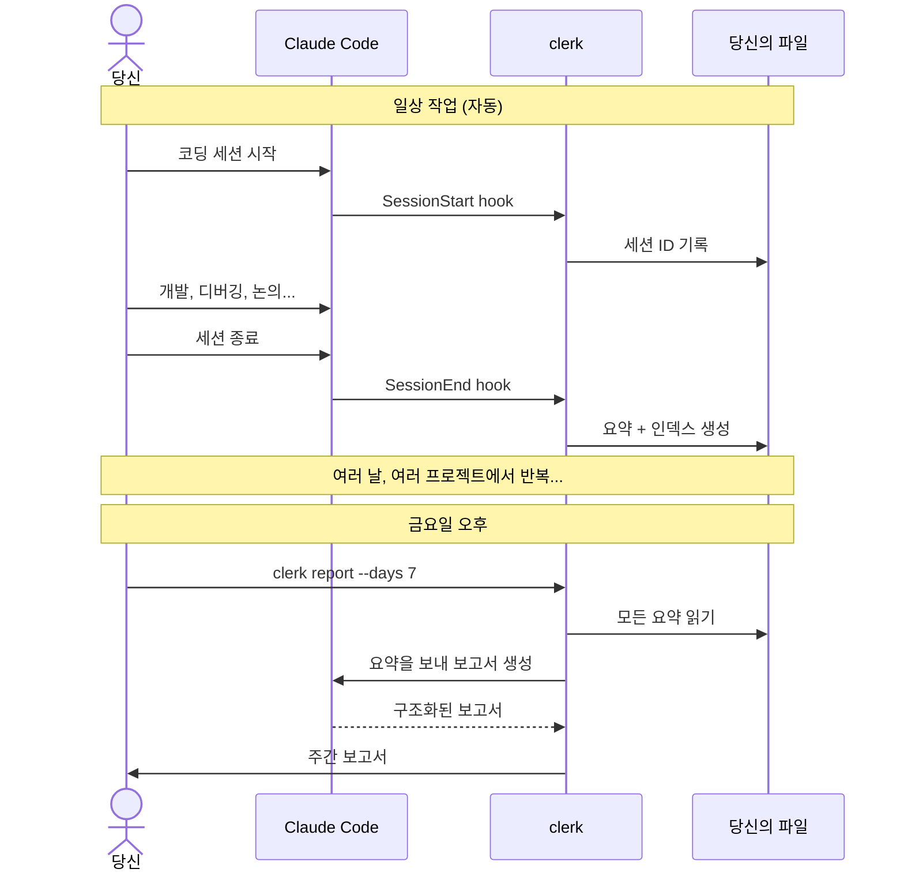

```
 ______     __         ______     ______     __  __    
/\  ___\   /\ \       /\  ___\   /\  == \   /\ \/ /    
\ \ \____  \ \ \____  \ \  __\   \ \  __<   \ \  _"-.  
 \ \_____\  \ \_____\  \ \_____\  \ \_\ \_\  \ \_\ \_\ 
  \/_____/   \/_____/   \/_____/   \/_/ /_/   \/_/\/_/  
```

[](https://github.com/vulcanshen/clerk/releases)
[](https://go.dev/)
[](https://goreportcard.com/report/github.com/vulcanshen/clerk)
[](LICENSE)

[English](README.md) | [繁體中文](README.zh-TW.md) | [日本語](README.ja.md)

**대부분의 AI 도구는 AI를 위해 만들어졌습니다. clerk는 사람을 위해 만들어졌습니다.**

Claude Code 세션은 터미널을 닫으면 사라집니다. clerk는 그것을 당신이 소유하는 검색 가능한 지식 베이스로 바꿔줍니다.

## 문제

금요일 오후, 주간 보고 시간입니다. `git log`를 열고 3개의 프로젝트, 8개의 세션, 5일 동안 실제로 무엇을 했는지 떠올려 봅니다. 작업의 절반은 git에 없습니다 — 디버깅, 조사, 아키텍처 결정, Claude와 논의한 트레이드오프, 이미 잊어버린 것들입니다.

Claude Code는 세션 간 기억을 유지하지 않습니다. 그리고 당신이 직접 기억할 필요도 없어야 합니다.

## Claude에게 직접 물어보면 되지 않나요?

해보세요. Claude Code를 열고 "지난주에 뭘 했지?"라고 물어보세요.

모릅니다. 현재 세션만 볼 수 있으니까요. 과거를 돌아보려면 올바른 세션 ID를 찾고, `--resume`으로 로드하고, 요약을 요청한 다음, 모든 프로젝트의 모든 세션에 대해 반복해야 합니다. 매번 Claude는 전체 원본 트랜스크립트를 다시 읽습니다 — 하나의 markdown 파일로 저장할 수 있었던 것을 재구성하기 위해 대량의 토큰을 소비합니다.

clerk의 접근 방식은 다릅니다: 세션 종료 시 1회의 API 호출로 증분 요약을 생성하고, 플레인 markdown으로 저장합니다. 금요일이면 당신의 한 주는 이미 요약되어 있습니다. `clerk report --days 7`로 그 요약들을 읽고 한 번에 구조화된 보고서를 생성합니다.

## 해결책

```bash
clerk register
```

끝입니다. clerk는 완전히 로컬에서 실행됩니다 — 원격 서비스 연결 없음, 계정 불필요, 데이터가 컴퓨터 밖으로 나가지 않습니다.

clerk는 Claude Code에 연결되어 백그라운드에서 조용히 작동합니다:

| 얻을 수 있는 것 | 방법 |
|----------------|------|
| **주간 보고서** | `clerk report --days 7` — 날짜별・프로젝트별 구조화된 보고서, 바로 붙여넣기 가능 |
| **컨텍스트 복원** | `/clerk-resume` — 이전 세션에서 컨텍스트를 즉시 재구축 |
| **검색 가능한 이력** | `/clerk-search` — 모든 프로젝트에서 키워드로 과거 작업 검색 |
| **일일 요약** | 자동 — 각 세션 종료 시 생성, 날짜・프로젝트별로 정리 |

한 번 설치하면 됩니다. 모든 세션이 자동으로 요약, 인덱싱, 검색 가능해집니다. 기억할 명령어도, 들일 습관도 없습니다.

## 당신의 데이터, 당신의 도구

clerk는 표준 YAML 프론트매터 + markdown으로 출력합니다 — 독점 형식 없음, 잠금 없음. 요약과 인덱스 파일은 다음 도구들로 읽을 수 있습니다:

- 모든 텍스트 에디터 (vim, VS Code, Sublime)
- Obsidian (그래프 뷰, 태그 패널 바로 사용 가능)
- Notion (markdown 가져오기)
- grep, ripgrep 또는 모든 CLI 도구
- 당신만의 스크립트

clerk와 Claude Code를 모두 제거해도 당신의 요약은 그대로 남아 있습니다 — 정리되고, 검색 가능하고, 연결된 상태로.

## 작동 방식



### 사용자 여정



### 라이프사이클

| 이벤트 | 동작 |
|--------|------|
| **세션 시작** | `clerk punch`가 세션 ID + 트랜스크립트 경로를 기록 |
| **세션 종료** | `clerk feed`가 요약을 생성하고 인덱스 항목을 구축 |
| **컨텍스트 필요** | `/clerk-resume`이 과거 요약과 트랜스크립트를 읽음 |
| **검색** | `/clerk-search`가 인덱스 항목의 의미론적 매칭 |
| **보고서 필요** | `clerk report --days 7`이 구조화된 보고서를 생성 |

### 데이터 구조

```
~/.clerk/
├── summary/YYYYMMDD/slug.md    ← 프로젝트별 일일 요약
├── index/term.md               ← 역 인덱스 (태그, 날짜, 프로젝트, 키워드)
├── sessions/slug.md            ← 세션 ID 이력
├── cursor/                     ← 증분 처리 상태
├── running/                    ← 활성 feed 프로세스 상태
└── log/                        ← 일일 로그
```

### 파일 형식

각 요약에는 관련된 모든 항목을 포함하는 YAML 프론트매터가 있습니다:

```yaml
---
tags:
  - go
  - auth
  - jwt
  - 20260418
  - my-api-server
---
```

각 인덱스 파일에는 일치하는 요약에 대한 markdown 링크가 포함됩니다:

```markdown
- [my-api-server+20260418](../summary/20260418/my-api-server.md)
- [my-api-server+20260419](../summary/20260419/my-api-server.md)
```

항목은 자연스럽게 겹칩니다 — "api"가 프로젝트 이름의 분할어이자 AI가 추출한 태그인 경우, 같은 파일을 가리켜 프로젝트와 주제 간의 연결을 만듭니다.

## 보고서

금요일 오후, 명령어 하나로:

```bash
clerk report --days 7
```

clerk가 지난 7일간의 모든 요약을 읽고, Claude에게 보내 정리하여 3가지 관점의 구조화된 보고서를 출력합니다:

- **요약** — 전체 기간의 개요, 프로젝트별로 정리
- **날짜별** — 매일 무엇을 했는지, 프로젝트별로 분류
- **프로젝트별** — 각 프로젝트의 진행 상황, 날짜별로 분류

stdout으로 출력. 저장, 붙여넣기, 원하는 대로:

```bash
clerk report --days 7 -o weekly-report.md
```

기본값은 `--days 1` (당일만) — 데일리 스탠드업 요약에 적합합니다.

아직 종료되지 않은 세션도 포함하려면 `--active`를 추가하세요:

```bash
clerk report --days 7 --active
```

> **주의:** `--active`는 활성 세션의 트랜스크립트를 즉시 처리하므로 추가 Claude API 호출이 발생합니다. 이 플래그 없이는 완료된 세션만 포함됩니다.

출력 예시:

```markdown
### 요약 (2026-04-14 ~ 2026-04-18)

#### my-api-server
JWT 사용자 인증 구현, 속도 제한 미들웨어 추가,
높은 동시성에서 커넥션 풀 누수 수정.

#### frontend-app
Vue 2에서 Vue 3으로 마이그레이션, Vuex를 Pinia로 교체, 모든 유닛 테스트 업데이트.

---

### 날짜별

#### 2026-04-14
- **my-api-server**: 리프레시 토큰 로테이션 포함 JWT 인증 구축
- **frontend-app**: Vue 3 마이그레이션 시작, 빌드 설정 업데이트

#### 2026-04-16
- **my-api-server**: 속도 제한 미들웨어 추가, 커넥션 풀 누수 수정
- **frontend-app**: Vuex를 Pinia로 교체, 12개 스토어 모듈 마이그레이션

---

### 프로젝트별

#### my-api-server
- **2026-04-14**: 리프레시 토큰 로테이션 포함 JWT 인증
- **2026-04-16**: 속도 제한 미들웨어, 커넥션 풀 누수 수정

#### frontend-app
- **2026-04-14**: Vue 3 마이그레이션 시작, 빌드 설정 업데이트
- **2026-04-16**: Vuex → Pinia 마이그레이션, 12개 스토어 모듈 변환
```

## 설치

### 빠른 설치

macOS / Linux / Git Bash:

```bash
curl -fsSL https://raw.githubusercontent.com/vulcanshen/clerk/main/install.sh | sh
```

Windows (PowerShell):

```powershell
irm https://raw.githubusercontent.com/vulcanshen/clerk/main/install.ps1 | iex
```

그런 다음 훅, MCP 서버, 스킬을 설정합니다:

```bash
clerk register
```

### 패키지 관리자

| 플랫폼 | 명령어 |
|--------|--------|
| Homebrew (macOS / Linux) | `brew install vulcanshen/tap/clerk` |
| Scoop (Windows) | `scoop bucket add vulcanshen https://github.com/vulcanshen/scoop-bucket && scoop install clerk` |
| Debian / Ubuntu | `sudo dpkg -i clerk_<version>_linux_amd64.deb` |
| RHEL / Fedora | `sudo rpm -i clerk_<version>_linux_amd64.rpm` |

### 소스에서 빌드

```bash
go install github.com/vulcanshen/clerk@latest
```

## 명령어 목록

| 명령어 | 설명 |
|--------|------|
| `register` | clerk를 Claude Code에 등록하고 환경 검증 |
| `unregister` | clerk를 Claude Code에서 등록 해제 |
| `config` | 현재 설정 표시 (`config show`의 별칭) |
| `config show` | 병합된 설정과 파일 경로 표시 |
| `config set <key> <value>` | 프로젝트 레벨 설정 값 변경 |
| `config set -g <key> <value>` | 전역 설정 값 변경 |
| `status` | 활성 feed 프로세스와 중단된 세션 표시 |
| `status --watch` | 실시간 상태 업데이트 (매초) |
| `status retry <slug>` | 지정한 중단 세션 재시도 |
| `status retry --all` | 모든 중단 세션 재시도 |
| `status kill <slug>` | 지정한 활성 feed 프로세스 강제 종료 |
| `status kill --all` | 모든 활성 feed 프로세스 강제 종료 |
| `report` | 최근 요약에서 보고서 생성 (기본: 당일) |
| `report --days 7 -o weekly.md` | 프로젝트 간 주간 보고서 |
| `logs` | 문제 해결을 위한 전체 로그 표시 |
| `logs --error` | 오류 로그만 표시 |
| `logs --no-mask` | 개인정보 마스킹 없이 원본 로그 표시 |
| `data moveto <path>` | clerk 데이터를 새 디렉토리로 이동하고 설정 업데이트 |
| `data purge` | 모든 clerk 데이터 삭제 (`-y`로 확인 건너뛰기) |
| `version` | 버전 표시 및 업데이트 확인 |

내부 명령어 (훅에서 호출되며, 사용자가 직접 사용하지 않음):

| 명령어 | 설명 |
|--------|------|
| `feed` | 세션 트랜스크립트를 처리하고 요약 생성 |
| `punch` | 세션 시작 시 세션 ID 기록 |
| `mcp` | MCP stdio 서버 시작 |

### v5.0.0에서 제거된 명령어

| 이전 | 현재 |
|------|------|
| `install` | `register` |
| `uninstall` | `unregister` |
| `diagnosis` | `register` |
| `diagnosis error` | `logs --error` |
| `diagnosis log` | `logs` |

## 설정

### 설정 파일

- 전역: `~/.config/clerk/.clerk.json`
- 프로젝트: 현재 또는 상위 디렉토리의 `.clerk.json` (가장 가까운 것이 우선)

### 사용 가능한 설정

```json
{
  "output": {
    "dir": "~/.clerk/",
    "language": "en"
  },
  "summary": {
    "model": "",
    "timeout": "5m"
  },
  "log": {
    "retention_days": 30
  },
  "feed": {
    "enabled": true
  }
}
```

| 설정 항목 | 기본값 | 설명 |
|-----------|--------|------|
| `output.dir` | `~/.clerk/` | 요약 저장 루트 디렉토리 |
| `output.language` | `en` | 요약 출력 언어 |
| `summary.model` | `""` (claude 기본값) | `claude -p`에서 사용할 모델 |
| `summary.timeout` | `5m` | `claude -p` 타임아웃 (예: 5m, 2m30s, 1h) |
| `log.retention_days` | `30` | 로그 및 커서 파일 보존 일수 |
| `feed.enabled` | `true` | 이 프로젝트의 feed 활성화/비활성화 |

### 예시

```bash
# 특정 프로젝트에서 feed 비활성화
cd /path/to/unimportant-project
clerk config set feed.enabled false

# 전역으로 더 저렴한 모델 사용
clerk config set -g summary.model haiku

# 전역으로 출력 언어 변경
clerk config set -g output.language en
```

## MCP 도구

설치 후 사용 가능 (`clerk register`). Claude Code가 스킬을 통해 호출하므로 직접 사용할 필요 없습니다:

| 도구 | 설명 |
|------|------|
| `clerk-resume` | 컨텍스트 복원을 위한 요약 + 트랜스크립트 파일 경로 반환 |
| `clerk-index-list` | 사용 가능한 모든 인덱스 항목 목록 (태그, 날짜, 프로젝트, 키워드) |
| `clerk-index-read` | 하나 이상의 인덱스 항목 내용 읽기 |

## 스킬

설치 후 사용 가능 (`clerk register`):

| 스킬 | 설명 |
|------|------|
| `/clerk-resume` | 이전 세션에서 컨텍스트 복원 — MCP 도구 호출, 파일 읽기, 컨텍스트 재구축 |
| `/clerk-search` | 키워드로 과거 세션 검색 — MCP 도구 호출, 일치하는 파일 읽기 |

## 문제 해결

문제가 발생하면 먼저 diagnosis를 실행하세요 — 환경을 확인하고 일반적인 문제를 자동 수정합니다:

```bash
clerk register
```

문제가 지속되면 오류 로그를 내보내고 [issue를 제출](https://github.com/vulcanshen/clerk/issues)하세요:

```bash
clerk logs --error --days 7
```

로그는 기본적으로 개인정보가 자동 마스킹됩니다. GitHub issue에 안전하게 붙여넣을 수 있습니다.

## 셸 자동 완성

```bash
# Zsh
mkdir -p ~/.zsh/completions
clerk completion zsh > ~/.zsh/completions/_clerk
echo 'fpath=(~/.zsh/completions $fpath)' >> ~/.zshrc
echo 'autoload -Uz compinit && compinit' >> ~/.zshrc
source ~/.zshrc

# Bash
clerk completion bash > /etc/bash_completion.d/clerk

# Fish
clerk completion fish > ~/.config/fish/completions/clerk.fish

# PowerShell
New-Item -ItemType Directory -Path (Split-Path $PROFILE) -Force
clerk completion powershell | Set-Content $PROFILE
```

## 라이선스

[GPL-3.0](LICENSE)
