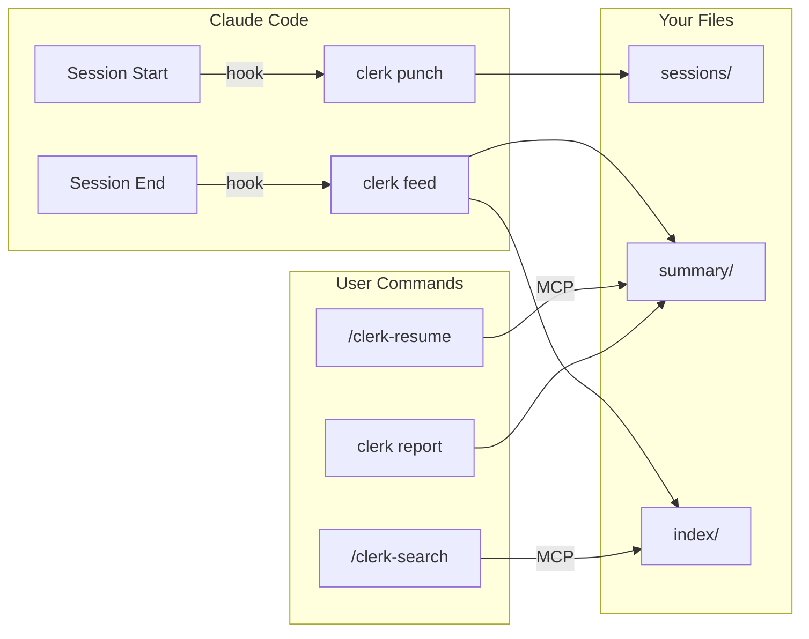
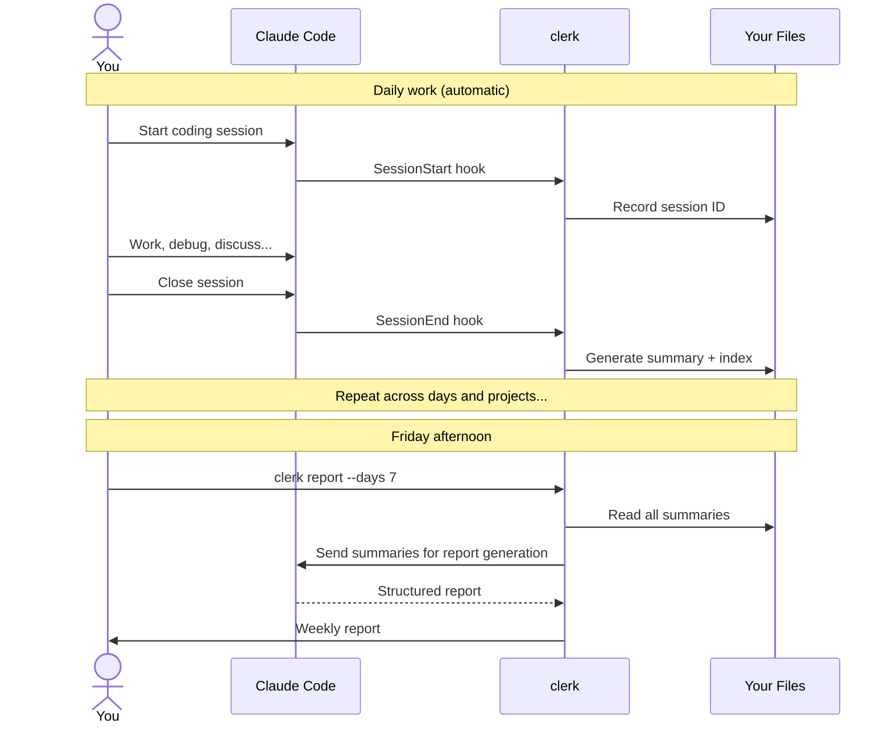

```
 ______     __         ______     ______     __  __    
/\  ___\   /\ \       /\  ___\   /\  == \   /\ \/ /    
\ \ \____  \ \ \____  \ \  __\   \ \  __<   \ \  _"-.  
 \ \_____\  \ \_____\  \ \_____\  \ \_\ \_\  \ \_\ \_\ 
  \/_____/   \/_____/   \/_____/   \/_/ /_/   \/_/\/_/  
```

[](https://github.com/vulcanshen/clerk/releases)
[](https://go.dev/)
[](https://goreportcard.com/report/github.com/vulcanshen/clerk)
[](LICENSE)

[繁體中文](README.zh-TW.md) | [日本語](README.ja.md) | [한국어](README.ko.md)

**Most AI tools are built for AI. clerk is built for humans.**

Your Claude Code sessions disappear when you close the terminal. clerk turns them into a searchable knowledge base that you own.

## The Problem

It's Friday afternoon. Time for the weekly report. You open `git log` and try to reconstruct what you actually did across three projects, eight sessions, and five days. Half the work isn't even in git — it was debugging, research, architecture decisions, conversations with Claude about trade-offs you've already forgotten.

Claude Code doesn't remember across sessions. And you shouldn't have to.

## Why not just ask Claude?

You could try. Open Claude Code and ask "what did I do last week?"

It doesn't know. It only sees the current session. To look back, you'd need to find the right session ID, load it with `--resume`, ask for a summary, then repeat for every session across every project. Each time, Claude re-reads the entire raw transcript — burning tokens to reconstruct what could have been saved in a single markdown file.

clerk takes a different approach: one API call per session, at the moment it ends, producing an incremental summary stored as plain markdown. By Friday, your week is already summarized. `clerk report --days 7` reads those summaries and generates a structured report in one shot.

## The Solution

```bash
clerk register
```

That's it. clerk runs entirely on your machine — no remote services, no accounts, no data leaving your laptop.

> **About token usage:** clerk uses your authenticated Claude Code (`claude -p`) to generate summaries and reports. Each session end triggers one API call for the summary, and each `clerk report` invocation is another call. Summaries only process new transcript content (cursor tracking), not the entire history. If you're on a tight quota, set `summary.model` to `haiku` or disable feed per-project (`clerk config set feed.enabled false`).

After registering, clerk works silently in the background:

| What you get | How |
|--------------|-----|
| **Weekly reports** | `clerk report --days 7` — structured report by date and project, ready to paste |
| **Context recovery** | `/clerk-resume` — instantly rebuild context from any previous session |
| **Searchable history** | `/clerk-search` — find past work by keyword across all projects |
| **Daily summaries** | Automatic — generated when each session ends, organized by date and project |

Register once. Every session is automatically summarized, indexed, and searchable. No commands to remember, no habits to build.

## Your data, your tools

clerk writes plain markdown with YAML frontmatter — no proprietary format, no lock-in. Summaries and index files are readable by:

- Any text editor (vim, VS Code, Sublime)
- Obsidian (graph view, tag pane work out of the box)
- Notion (import markdown)
- grep, ripgrep, or any CLI tool
- Your own scripts

If you uninstall clerk and Claude Code tomorrow, your summaries are still yours — organized, searchable, and linked.

## How It Works



### User Journey



### Lifecycle

| Event | What happens |
|-------|-------------|
| **Session starts** | `clerk punch` records session ID + transcript path |
| **Session ends** | `clerk feed` generates summary, builds index entries |
| **You need context** | `/clerk-resume` reads past summaries and transcripts |
| **You search** | `/clerk-search` uses semantic matching on index terms |
| **You need a report** | `clerk report --days 7` generates a structured report |

### Data structure

A **slug** is a filesystem-safe identifier derived from your working directory — e.g. `/Users/you/projects/my-app` becomes `projects-my-app`. It strips the home prefix, lowercases, and replaces `/` with `-`.

```
~/.clerk/
├── summary/YYYYMMDD/slug.md    ← daily summaries per project
├── index/term.md               ← inverted index (tags, dates, projects, keywords)
├── sessions/slug.md            ← session ID history
├── cursor/                     ← incremental processing state
├── running/                    ← active feed process state
└── log/                        ← daily logs
```

### File format

Each summary has YAML frontmatter with all related terms:

```yaml
---
tags:
  - go
  - auth
  - jwt
  - 20260418
  - my-api-server
---
```

Each index file contains markdown links to matching summaries:

```markdown
- [my-api-server+20260418](../summary/20260418/my-api-server.md)
- [my-api-server+20260419](../summary/20260419/my-api-server.md)
```

Terms naturally overlap — if "api" is both a word from the project slug and an AI-extracted tag, they point to the same file, creating connections across projects and topics.

## Report

Friday afternoon, one command:

```bash
clerk report --days 7
```

clerk reads all summaries from the past 7 days, sends them to Claude, and outputs a structured report with three views:

- **Summary** — high-level overview of the entire period, organized by project
- **By Date** — what was done each day, broken down by project
- **By Project** — what was done on each project, broken down by date

Output goes to stdout. Save it, paste it, or pipe it wherever you need:

```bash
clerk report --days 7 -o weekly-report.md
```

Default is `--days 1` (today only) — useful as a daily standup summary.

Want to include sessions that haven't ended yet? Add `--active`:

```bash
clerk report --days 7 --active
```

> **Note:** `--active` processes active session transcripts on the spot, which uses additional Claude API calls. Without this flag, only completed sessions are included.

Example output:

```markdown
### Summary (2026-04-14 ~ 2026-04-18)

#### my-api-server
Implemented user authentication with JWT, added rate limiting middleware,
and fixed connection pool leak under high concurrency.

#### frontend-app
Migrated from Vue 2 to Vue 3, replaced Vuex with Pinia, updated all unit tests.

---

### By Date

#### 2026-04-14
- **my-api-server**: Set up JWT auth with refresh token rotation
- **frontend-app**: Started Vue 3 migration, updated build config

#### 2026-04-16
- **my-api-server**: Added rate limiting middleware, fixed connection pool leak
- **frontend-app**: Replaced Vuex with Pinia, migrated 12 store modules

---

### By Project

#### my-api-server
- **2026-04-14**: JWT auth with refresh token rotation
- **2026-04-16**: Rate limiting middleware, connection pool leak fix

#### frontend-app
- **2026-04-14**: Vue 3 migration kickoff, build config update
- **2026-04-16**: Vuex → Pinia migration, 12 store modules converted
```

## Installation

### Quick Install

**Step 1:** Download the clerk binary

macOS / Linux / Git Bash:

```bash
curl -fsSL https://raw.githubusercontent.com/vulcanshen/clerk/main/install.sh | sh
```

Windows (PowerShell):

```powershell
irm https://raw.githubusercontent.com/vulcanshen/clerk/main/install.ps1 | iex
```

**Step 2:** Register with Claude Code

```bash
clerk register
```

### Package Managers

| Platform | Command |
|----------|---------|
| Homebrew (macOS / Linux) | `brew install vulcanshen/tap/clerk` |
| Scoop (Windows) | `scoop bucket add vulcanshen https://github.com/vulcanshen/scoop-bucket && scoop install clerk` |
| Debian / Ubuntu | `sudo dpkg -i clerk_<version>_linux_amd64.deb` |
| RHEL / Fedora | `sudo rpm -i clerk_<version>_linux_amd64.rpm` |

### Build from Source

```bash
go install github.com/vulcanshen/clerk@latest
```

## Commands

| Command | Description |
|---------|-------------|
| `register` | Register clerk with Claude Code and verify environment |
| `unregister` | Unregister clerk from Claude Code |
| `config` | Show current configuration (alias for `config show`) |
| `config show` | Show merged configuration and file paths |
| `config show --json` | Output configuration in JSON format |
| `config set <key> <value>` | Set project-level config value |
| `config set -g <key> <value>` | Set global config value |
| `status` | Show active feed processes and interrupted sessions |
| `status --watch` | Live-refresh status every second |
| `status --json` | Output status in JSON format |
| `status retry <slug>` | Retry a specific interrupted session |
| `status retry --all` | Retry all interrupted sessions |
| `status kill <slug>` | Kill a specific active feed process |
| `status kill --all` | Kill all active feed processes |
| `summary` | List all project slugs with summaries |
| `summary <slug>` | View merged summaries across all dates for a project |
| `report` | Generate a report and auto-save to `reports/` (piped: stdout) |
| `report --days 7 -o weekly.md` | Weekly report across all projects |
| `logs` | Show all logs for troubleshooting |
| `logs --error` | Show error logs only |
| `logs --no-mask` | Show raw logs without redacting personal info |
| `data moveto <path>` | Move clerk data to a new directory and update config |
| `version` | Show current version and check for updates |

Internal commands (called by hooks, not by users):

| Command | Description |
|---------|-------------|
| `feed` | Process session transcript and generate summary |
| `punch` | Record session ID on session start |
| `mcp` | Start MCP stdio server |

### Dropped in v5.0.0

| Old | New |
|-----|-----|
| `install` | `register` |
| `uninstall` | `unregister` |
| `diagnosis` | `register` |
| `diagnosis error` | `logs --error` |
| `diagnosis log` | `logs` |
| `data purge` | removed — use `rm -rf ~/.clerk/` |

## Configuration

### Config files

- Global: `~/.config/clerk/.clerk.json`
- Project: `.clerk.json` in the current or any parent directory (nearest match wins)

### Available settings

```json
{
  "output": {
    "dir": "~/.clerk/",
    "language": "en"
  },
  "summary": {
    "model": "",
    "timeout": "5m"
  },
  "log": {
    "retention_days": 30
  },
  "feed": {
    "enabled": true
  }
}
```

| Key | Default | Description |
|-----|---------|-------------|
| `output.dir` | `~/.clerk/` | Root directory for summaries |
| `output.language` | `en` | Summary output language |
| `summary.model` | `""` (claude default) | Model to use for `claude -p` |
| `summary.timeout` | `5m` | Timeout for `claude -p` calls (e.g. 5m, 2m30s, 1h) |
| `log.retention_days` | `30` | Days to keep log and cursor files |
| `feed.enabled` | `true` | Enable/disable feed for this project |

### Examples

```bash
# Disable feed for a specific project
cd /path/to/unimportant-project
clerk config set feed.enabled false

# Use a cheaper model globally
clerk config set -g summary.model haiku

# Change output language globally
clerk config set -g output.language en
```

## MCP Tools

Available when registered (`clerk register`). These are called by Claude Code through skills — you don't need to invoke them directly.

| Tool | Description |
|------|-------------|
| `clerk-resume` | Returns summary + transcript file paths for context recovery |
| `clerk-index-list` | List all available index terms (tags, dates, projects, keywords) |
| `clerk-index-read` | Read the content of one or more index terms |

## Skills

Available when registered (`clerk register`):

| Skill | Description |
|-------|-------------|
| `/clerk-resume` | Recover context from previous sessions — calls MCP tool, reads files, rebuilds context |
| `/clerk-search` | Search past sessions by keyword — calls MCP tool, reads matching files |

## Troubleshooting

If something isn't working, re-run `register` — it checks your environment and auto-fixes common issues:

```bash
clerk register
```

If the problem persists, export error logs and [open an issue](https://github.com/vulcanshen/clerk/issues):

```bash
clerk logs --error --days 7
```

Logs are automatically redacted (paths, usernames) by default. The output is safe to paste in a GitHub issue. Use `--no-mask` to see the raw content.

## Shell Completion

```bash
# Zsh
mkdir -p ~/.zsh/completions
clerk completion zsh > ~/.zsh/completions/_clerk
echo 'fpath=(~/.zsh/completions $fpath)' >> ~/.zshrc
echo 'autoload -Uz compinit && compinit' >> ~/.zshrc
source ~/.zshrc

# Bash
clerk completion bash > /etc/bash_completion.d/clerk

# Fish
clerk completion fish > ~/.config/fish/completions/clerk.fish

# PowerShell
New-Item -ItemType Directory -Path (Split-Path $PROFILE) -Force
clerk completion powershell | Set-Content $PROFILE
```

## License

[GPL-3.0](LICENSE)
