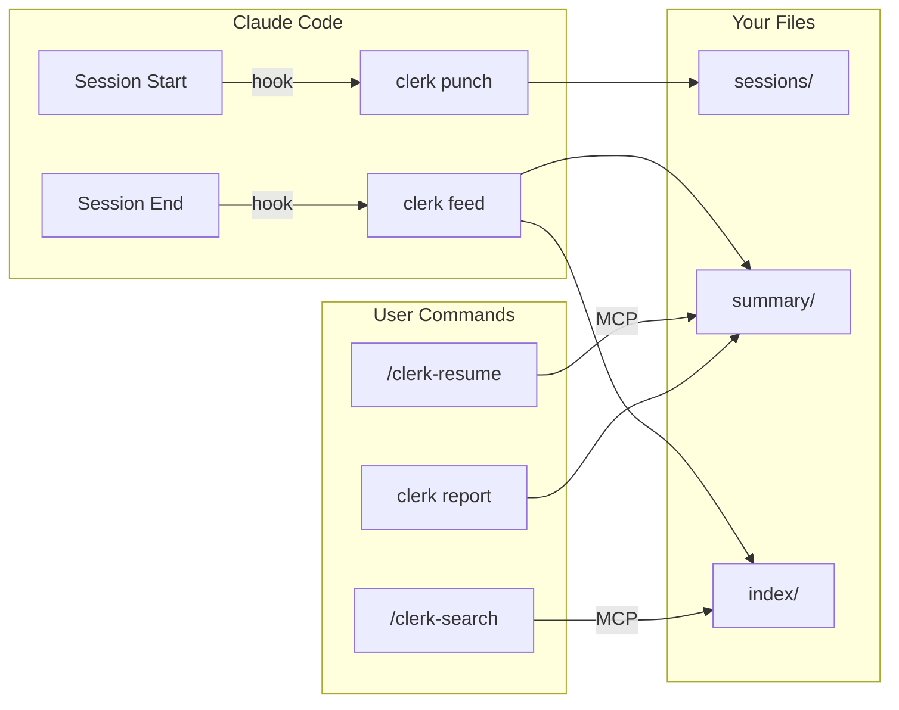
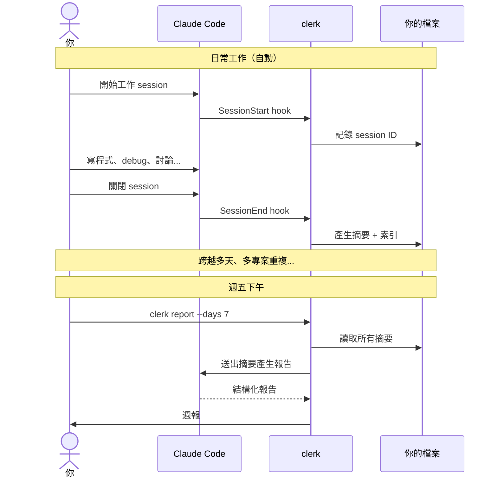

```
 ______     __         ______     ______     __  __    
/\  ___\   /\ \       /\  ___\   /\  == \   /\ \/ /    
\ \ \____  \ \ \____  \ \  __\   \ \  __<   \ \  _"-.  
 \ \_____\  \ \_____\  \ \_____\  \ \_\ \_\  \ \_\ \_\ 
  \/_____/   \/_____/   \/_____/   \/_/ /_/   \/_/\/_/  
```

[](https://github.com/vulcanshen/clerk/releases)
[](https://go.dev/)
[](https://goreportcard.com/report/github.com/vulcanshen/clerk)
[](LICENSE)

[English](README.md) | [日本語](README.ja.md) | [한국어](README.ko.md)

**多數 AI 工具是為 AI 而生的。clerk 是為人而生的。**

你的 Claude Code session 關掉終端機就消失了。clerk 把它們變成一個你擁有的、可搜尋的知識庫。

## 問題

週五下午，該交週報了。你打開 `git log`，試圖回想這週橫跨三個專案、八個 session、五天裡到底做了什麼。有一半的工作根本不在 git 裡 — 那些是 debug、研究、架構決策、和 Claude 討論的各種權衡取捨，你早就忘了。

Claude Code 不會跨 session 記憶。而你不應該需要自己記。

## 為什麼不直接問 Claude？

你可以試試看。打開 Claude Code，問它「我上週做了什麼？」

它不知道。它只看得到當前 session。要回顧過去，你得自己找到對的 session ID、用 `--resume` 載入、請它摘要，然後對每個專案、每個 session 重複一次。每次 Claude 都要重新讀一遍完整的原始 transcript — 燒掉大量 token 來重建一份本來可以用一個 markdown 檔案存起來的東西。

clerk 的做法不同：每次 session 結束時只要一次 API 呼叫，產生增量摘要，存成純 markdown。到了週五，你的一週已經摘要好了。`clerk report --days 7` 讀取那些摘要，一次生成結構化報告。

## 解決方案

```bash
clerk register
```

就這樣。clerk 完全在本地執行 — 不連任何遠端服務、不需要帳號、資料不會離開你的電腦。

> **關於 token 消耗：** clerk 使用你已登入的 Claude Code 來產生摘要和報告（透過 `claude -p`）。每個 session 結束時會消耗一次 API 額度產生摘要，每次執行 `clerk report` 也會消耗一次。摘要只處理新增的對話內容（cursor tracking），不會重複讀取舊資料。如果你在意額度，可以設定 `summary.model` 為 `haiku` 或在特定專案中停用 feed（`clerk config set feed.enabled false`）。

註冊後，clerk 會在背景安靜地運作：

| 你得到什麼 | 怎麼做 |
|-----------|--------|
| **週報** | `clerk report --days 7` — 依日期和專案整理的結構化報告，直接貼上就行 |
| **上下文恢復** | `/clerk-resume` — 立即從任何之前的 session 重建上下文 |
| **可搜尋的歷史** | `/clerk-search` — 跨所有專案用關鍵字搜尋過去的工作 |
| **每日摘要** | 全自動 — 每個 session 結束時自動產生，依日期和專案整理 |

註冊一次。每個 session 都會自動摘要、建立索引、可搜尋。不需要記任何指令，不需要養成任何習慣。

## 你的資料，你的工具

clerk 輸出的是標準的 YAML frontmatter + markdown — 沒有專有格式，沒有鎖定。摘要和索引檔案可以被以下工具讀取：

- 任何文字編輯器（vim、VS Code、Sublime）
- Obsidian（graph view、tag pane 直接可用）
- Notion（匯入 markdown）
- grep、ripgrep 或任何命令列工具
- 你自己的腳本

就算你把 clerk 和 Claude Code 都移除了，你的摘要還是你的 — 有組織、可搜尋、有關聯。

## 運作原理



### 使用者旅程



### 生命週期

| 事件 | 發生什麼 |
|------|---------|
| **Session 開始** | `clerk punch` 記錄 session ID + transcript 路徑 |
| **Session 結束** | `clerk feed` 產生摘要，建立索引項目 |
| **需要上下文** | `/clerk-resume` 讀取過去的摘要和 transcript |
| **搜尋** | `/clerk-search` 用語意比對搜尋索引項目 |
| **需要報告** | `clerk report --days 7` 產生結構化報告 |

### 資料結構

**slug** 是從工作目錄產生的檔案系統安全識別碼 — 例如 `/Users/you/projects/my-app` 會變成 `projects-my-app`。去除 home 前綴、轉小寫、`/` 替換為 `-`。

```
~/.clerk/
├── summary/YYYYMMDD/slug.md    ← 每日每專案摘要
├── index/term.md               ← 倒排索引（標籤、日期、專案、關鍵字）
├── sessions/slug.md            ← session ID 歷史
├── cursor/                     ← 增量處理狀態
├── running/                    ← 進行中的 feed 狀態
└── log/                        ← 每日日誌
```

### 檔案格式

每個摘要的 YAML frontmatter 包含所有相關項目：

```yaml
---
tags:
  - go
  - auth
  - jwt
  - 20260418
  - my-api-server
---
```

每個索引檔案包含指向對應摘要的 markdown 連結：

```markdown
- [my-api-server+20260418](../summary/20260418/my-api-server.md)
- [my-api-server+20260419](../summary/20260419/my-api-server.md)
```

項目會自然重疊 — 如果 "api" 同時是專案名稱拆分的字和 AI 提取的標籤，它們指向同一個檔案，建立跨專案和主題的關聯。

## 報告

週五下午，一行指令：

```bash
clerk report --days 7
```

clerk 讀取過去 7 天的所有摘要，丟給 Claude 整理，輸出結構化報告，包含三個視角：

- **總結** — 整段時間的高階概覽，依專案分類
- **依日期** — 每天做了什麼，下分各專案
- **依專案** — 每個專案的進度，下分各日期

輸出到 stdout。存檔、貼上、隨你處理：

```bash
clerk report --days 7 -o weekly-report.md
```

預設 `--days 1`（只看當天）— 適合當每日站會摘要。

想包含還沒結束的 session？加上 `--active`：

```bash
clerk report --days 7 --active
```

> **注意：** `--active` 會即時處理進行中的 session transcript，這會消耗額外的 Claude API 額度。不加此旗標時，只包含已結束的 session。

輸出範例：

```markdown
### 總結 (2026-04-14 ~ 2026-04-18)

#### my-api-server
實作 JWT 使用者驗證、新增速率限制 middleware、修復高併發下的連線池洩漏。

#### frontend-app
從 Vue 2 遷移至 Vue 3，以 Pinia 取代 Vuex，更新所有單元測試。

---

### 依日期

#### 2026-04-14
- **my-api-server**：建立 JWT 驗證與 refresh token 輪換
- **frontend-app**：啟動 Vue 3 遷移、更新建置設定

#### 2026-04-16
- **my-api-server**：新增速率限制 middleware、修復連線池洩漏
- **frontend-app**：以 Pinia 取代 Vuex，遷移 12 個 store 模組

---

### 依專案

#### my-api-server
- **2026-04-14**：JWT 驗證與 refresh token 輪換
- **2026-04-16**：速率限制 middleware、連線池洩漏修復

#### frontend-app
- **2026-04-14**：Vue 3 遷移啟動、建置設定更新
- **2026-04-16**：Vuex → Pinia 遷移，12 個 store 模組轉換
```

## 安裝

### 快速安裝

**第一步：** 下載 clerk binary

macOS / Linux / Git Bash：

```bash
curl -fsSL https://raw.githubusercontent.com/vulcanshen/clerk/main/install.sh | sh
```

Windows（PowerShell）：

```powershell
irm https://raw.githubusercontent.com/vulcanshen/clerk/main/install.ps1 | iex
```

**第二步：** 註冊到 Claude Code

```bash
clerk register
```

### 套件管理器

| 平台 | 指令 |
|------|------|
| Homebrew（macOS / Linux） | `brew install vulcanshen/tap/clerk` |
| Scoop（Windows） | `scoop bucket add vulcanshen https://github.com/vulcanshen/scoop-bucket && scoop install clerk` |
| Debian / Ubuntu | `sudo dpkg -i clerk_<version>_linux_amd64.deb` |
| RHEL / Fedora | `sudo rpm -i clerk_<version>_linux_amd64.rpm` |

### 從原始碼安裝

```bash
go install github.com/vulcanshen/clerk@latest
```

## 指令

| API | 指令 | 說明 |
|:---:|------|------|
| * | `register` | 將 clerk 註冊到 Claude Code 並驗證環境 |
| | `unregister` | 從 Claude Code 取消註冊 clerk |
| | `config` | 顯示目前的設定（等同 `config show`） |
| | `config show` | 顯示合併後的設定與檔案路徑 |
| | `config show --json` | 以 JSON 格式輸出設定 |
| | `config set <key> <value>` | 設定專案層級的配置值 |
| | `config set -g <key> <value>` | 設定全域配置值 |
| | `status` | 顯示進行中的 feed process 和中斷的 session |
| | `status --watch` | 即時重新整理狀態（每秒更新） |
| | `status --json` | 以 JSON 格式輸出狀態 |
| * | `status retry <slug>` | 重試指定的中斷 session |
| * | `status retry --all` | 重試所有中斷的 session |
| | `status kill <slug>` | 強制終止指定的 feed process |
| | `status kill --all` | 強制終止所有 feed process |
| | `export` | 列出可匯出的 slug 和日期 |
| | `export --summary <slug>` | 匯出指定專案的合併摘要（跨日期） |
| | `export --date <YYYYMMDD>` | 匯出指定日期的合併摘要（跨專案） |
| * | `report` | 產生報告並自動存到 `reports/`（pipe 時輸出到 stdout） |
| * | `report --days 7 -o weekly.md` | 產生跨專案週報 |
| * | `logs` | 顯示所有日誌供排查 |
| * | `logs --error` | 僅顯示錯誤日誌 |
| | `logs --no-mask` | 顯示原始日誌，不遮蔽個資 |
| | `data moveto <path>` | 搬遷 clerk 資料到新目錄並更新設定 |
| | `version` | 顯示版本並檢查更新 |

`*` = 使用 Claude API（消耗 token）

內部指令（由 hook 呼叫，非使用者直接使用）：

| API | 指令 | 說明 |
|:---:|------|------|
| * | `feed` | 處理 session 對話記錄並產生摘要 |
| | `punch` | 在 session 開始時記錄 session ID |
| | `mcp` | 啟動 MCP stdio server |

### v5.0.0 移除的指令

| 舊指令 | 新指令 |
|--------|--------|
| `install` | `register` |
| `uninstall` | `unregister` |
| `diagnosis` | `register` |
| `diagnosis error` | `logs --error` |
| `diagnosis log` | `logs` |
| `data purge` | 已移除 — 使用 `rm -rf ~/.clerk/` |

## 設定

### 設定檔

- 全域：`~/.config/clerk/.clerk.json`
- 專案：當前或任何上層目錄中的 `.clerk.json`（最近的優先）

### 可用設定

```json
{
  "output": {
    "dir": "~/.clerk/",
    "language": "en"
  },
  "summary": {
    "model": "",
    "timeout": "5m"
  },
  "log": {
    "retention_days": 30
  },
  "feed": {
    "enabled": true
  }
}
```

| 設定項 | 預設值 | 說明 |
|--------|--------|------|
| `output.dir` | `~/.clerk/` | 摘要存放根目錄 |
| `output.language` | `en` | 摘要輸出語言 |
| `summary.model` | `""`（使用 claude 預設） | `claude -p` 使用的模型 |
| `summary.timeout` | `5m` | `claude -p` 的逾時時間（如 5m、2m30s、1h） |
| `log.retention_days` | `30` | Log 和 cursor 檔案保留天數 |
| `feed.enabled` | `true` | 啟用/停用此專案的 feed |

### 範例

```bash
# 停用特定專案的 feed
cd /path/to/unimportant-project
clerk config set feed.enabled false

# 全域使用較便宜的模型
clerk config set -g summary.model haiku

# 全域變更輸出語言
clerk config set -g output.language en
```

## MCP 工具

註冊後可用（`clerk register`）。這些由 Claude Code 透過 skill 呼叫，不需要直接使用：

| 工具 | 說明 |
|------|------|
| `clerk-resume` | 回傳摘要 + transcript 檔案路徑，用於恢復上下文 |
| `clerk-index-list` | 列出所有可用的索引項目（標籤、日期、專案、關鍵字） |
| `clerk-index-read` | 讀取一個或多個索引項目的內容 |

## Skills

註冊後可用（`clerk register`）：

| Skill | 說明 |
|-------|------|
| `/clerk-resume` | 從之前的 session 恢復上下文 — 呼叫 MCP 工具、讀取檔案、重建上下文 |
| `/clerk-search` | 透過關鍵字搜尋過去的 session — 呼叫 MCP 工具、讀取符合的檔案 |

## 疑難排解

如果有問題，重新執行 `register` — 它會檢查環境並自動修復常見問題：

```bash
clerk register
```

如果問題仍然存在，匯出錯誤日誌並[提交 issue](https://github.com/vulcanshen/clerk/issues)：

```bash
clerk logs --error --days 7
```

日誌預設自動遮蔽個資（路徑、使用者名稱等），輸出可以直接貼到 GitHub issue。需要看原始內容時加 `--no-mask`。

## Shell 自動補全

```bash
# Zsh
mkdir -p ~/.zsh/completions
clerk completion zsh > ~/.zsh/completions/_clerk
echo 'fpath=(~/.zsh/completions $fpath)' >> ~/.zshrc
echo 'autoload -Uz compinit && compinit' >> ~/.zshrc
source ~/.zshrc

# Bash
clerk completion bash > /etc/bash_completion.d/clerk

# Fish
clerk completion fish > ~/.config/fish/completions/clerk.fish

# PowerShell
New-Item -ItemType Directory -Path (Split-Path $PROFILE) -Force
clerk completion powershell | Set-Content $PROFILE
```

## 授權條款

[GPL-3.0](LICENSE)
